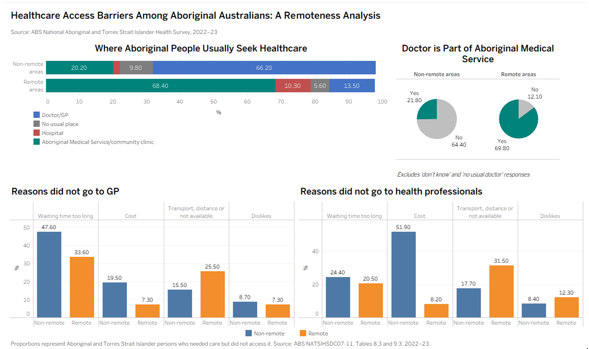
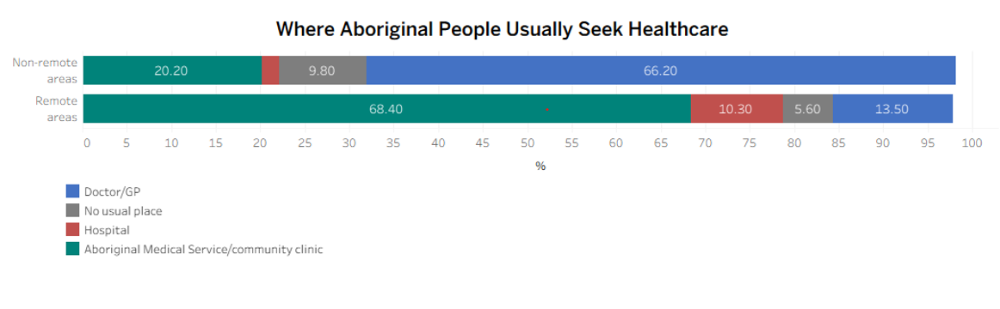
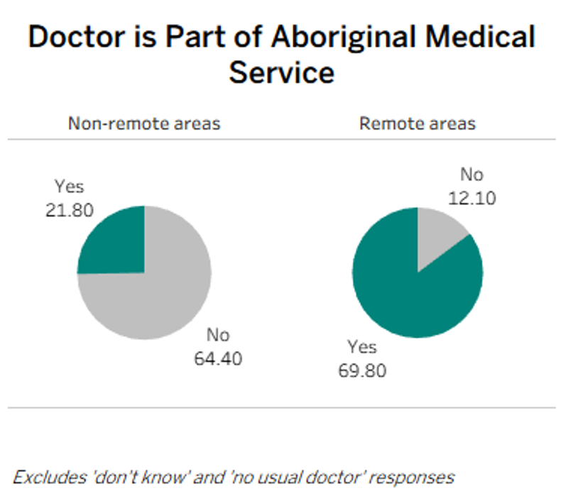
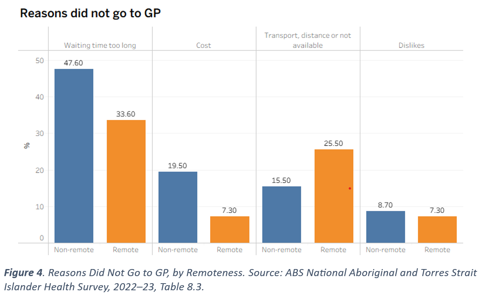
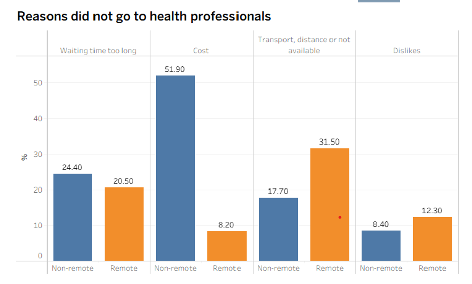

# Healthcare Access Inequality — Aboriginal & Torres Strait Islander Communities


---

## Project Overview

This project analyses systematic barriers to healthcare access for Aboriginal and Torres Strait Islander communities across remote and non-remote areas of Australia, using data from the **ABS National Aboriginal and Torres Strait Islander Health Survey, 2022–23**.

The analysis identifies how the nature of healthcare barriers fundamentally differs based on geographic location — with remote communities predominantly facing transport and distance barriers, while non-remote communities face waiting time and cost barriers. These findings are examined through a **Justice and Fairness Ethics** lens, guided by the **AIATSIS Impact and Value** framework.

This project was completed as part of **IFN585 Systems Innovation and Design** at Queensland University of Technology (QUT), 2026.

---

## Key Findings

- **Remote communities** are overwhelmingly reliant on Aboriginal Medical Services (AMS) as their primary healthcare provider (68.4%), compared to only 21.8% in non-remote areas
- **Transport and distance** is the dominant barrier for remote Aboriginal communities across GP (25.5%), specialist (31.5%) and hospital (35.0%) services
- **Waiting time** is the dominant barrier for non-remote Aboriginal communities across GP (47.6%) and specialist (24.4%) services
- **Cost** is a significantly greater barrier for non-remote communities seeking specialist care (51.9%) compared to remote areas (8.2%)
- These patterns are **consistent across all three service types** — GP, specialist and hospital — reinforcing the argument that geographic location unjustly determines the nature of healthcare barriers faced
- Cultural respect experiences show **minimal variation by remoteness** (88.2% non-remote vs 88.1% remote), suggesting cultural discomfort barriers may reflect deeper historical distrust rather than current service interactions

---

## Dashboard



*Figure 1: Healthcare Access Barriers Among Aboriginal Australians: A Remoteness Analysis*
*Source: ABS National Aboriginal and Torres Strait Islander Health Survey, 2022–23, Tables 8.3 and 9.3*

---

## Visualisations

### Where Aboriginal People Usually Seek Healthcare


*A 100% stacked bar chart showing the dramatic inversion in healthcare destination between remote and non-remote areas — GP dominates non-remote (66.2%) while AMS dominates remote (68.4%)*

---

### Doctor is Part of Aboriginal Medical Service


*Side-by-side pie charts showing that 69.8% of remote Aboriginal communities' doctors are part of an AMS, compared to only 21.8% in non-remote areas*

---

### Reasons Did Not Go to GP


*Grouped bar chart comparing four systematic barriers to GP access between remote and non-remote communities*

---

### Reasons Did Not Go to Health Professionals


*Grouped bar chart comparing four systematic barriers to specialist access between remote and non-remote communities — notably Cost is the dominant barrier in non-remote areas at 51.9%*

---

## Repository Structure

```
healthcare-access-inequality/
│
├── README.md                          # Project documentation
├── dashboard.png                      # Full Tableau dashboard screenshot
├── where_seek_healthcare.png          # Chart 1 — Where people usually seek healthcare
├── ams_pie.png                        # Chart 2 — Doctor is part of AMS pie chart
├── gp_barriers.png                    # Chart 3 — GP barriers by remoteness
├── specialist_barriers.png            # Chart 4 — Specialist barriers by remoteness
│
├── data/
│   ├── Assesment_2_Resons.xlsx        # Cleaned barrier data (Tables 8.3)
│   └── Assesment1_sheets.xlsx         # Cleaned healthcare destination data (Table 9.3)
│
└── report/
    └── IFN585_Assessment_1.pdf        # Full analytical report (optional)
```

---

## Data Sources

| Source | Description | Tables Used |
|--------|-------------|-------------|
| ABS National Aboriginal and Torres Strait Islander Health Survey, 2022–23 | National survey of health service use and barriers for Aboriginal and Torres Strait Islander peoples | Tables 8.3 (Barriers) and 9.3 (Healthcare destination) |

**Data accessed from:**
Australian Bureau of Statistics. (2023). *National Aboriginal and Torres Strait Islander Health Survey, 2022–23*. ABS. https://www.abs.gov.au/statistics/people/aboriginal-and-torres-strait-islander-peoples/national-aboriginal-and-torres-strait-islander-health-survey/2022-23

### Data Notes
- Proportions represent Aboriginal and Torres Strait Islander persons who needed care but did not access it
- Cell values have been randomly adjusted by ABS to avoid release of confidential data — sums of components may not equal 100%
- Values marked with `#` in the original dataset indicate high margin of error and should be interpreted with caution
- Sum of barrier components may exceed 100% as respondents could report multiple reasons

### Data Cleaning Decisions
The following categories were excluded from analysis with justification:

| Excluded Category | Reason |
|---|---|
| "Too busy" | Personal decision — not a systematic barrier |
| "Decided not to seek care" | Personal decision — not a systematic barrier |
| "Other" | Unspecified responses — not analytically interpretable |
| Hospital barrier chart | Insufficient alignment with barrier categories examined |

---

## Tools and Technologies

| Tool | Purpose |
|------|---------|
| **Tableau Desktop** | Data visualisation and dashboard design |
| **Microsoft Excel** | Data cleaning and preparation |
| **ABS NATSIHSDC07-11** | Source dataset |

---

## Ethical Framework

This project applies two complementary ethical frameworks:

### Justice and Fairness Ethics (Rawls, 1971)
Justice and Fairness Ethics argues that resources and opportunities should be distributed equitably across society, and that systematic disadvantage based on factors outside a person's control — such as geographic location — is unjust. This framework was applied to evaluate whether healthcare barriers are fairly distributed across remote and non-remote Aboriginal communities.

### AIATSIS Impact and Value Framework
The Impact and Value quadrant of the AIATSIS framework requires that data analytics affecting Indigenous communities remain unbiased and actively seek to correct systemic inequalities rather than merely describe them. This framework guided the analytical approach, ensuring findings are used to inform policy improvements rather than reinforce existing disparities.

**Key ethical consideration:** Where a person lives should not determine what barriers they face when accessing healthcare. The data demonstrates this principle is currently being violated for remote Aboriginal communities in Australia.

---

## Limitations

- Dataset only distinguishes between **remote and non-remote** — more granular categories (very remote, regional) would provide deeper insights
- **No AMS-specific barrier data** available — prevents complete analysis of remote healthcare access through Aboriginal Medical Services
- Several key estimates carry **high margins of error** — particularly remote area transport and waiting time values
- The high proportion of **"Other" responses** suggests existing survey categories may not fully capture all barriers, particularly culturally specific ones
- These gaps reflect limitations in mainstream data collection frameworks that may inadequately capture Indigenous-specific healthcare experiences

---

## Policy Recommendations

Based on the findings, three key policy recommendations are proposed:

1. **Transport infrastructure investment** — Given transport is the dominant barrier across all service types in remote areas, investment in patient travel assistance programs and mobile health clinics would directly address this inequity

2. **Increased AMS/ACCHO funding** — Remote Aboriginal communities are heavily reliant on Aboriginal Medical Services (68.4%); increased funding for AMS expansion would strengthen the primary healthcare system in remote areas

3. **Workforce and bulk billing expansion** — To address waiting time and cost barriers in non-remote areas, expansion of medical workforce and bulk billing incentives would improve healthcare accessibility

---

## References

Australian Bureau of Statistics. (2023). *Aboriginal and Torres Strait Islander life expectancy, 2020–2022*. ABS. https://www.abs.gov.au/statistics/people/aboriginal-and-torres-strait-islander-peoples/aboriginal-and-torres-strait-islander-life-expectancy/latest-release

Australian Institute of Health and Welfare. (2025, April 9). *Deaths in Australia*. Australian Institute of Health and Welfare. https://www.aihw.gov.au/reports/life-expectancy-deaths/deaths-in-australia/contents/life-expectancy

Australian Institute of Health and Welfare. (2025a). *Aboriginal and Torres Strait Islander health performance framework: Summary report 2023*. AIHW. https://www.indigenoushpf.gov.au/report-overview/overview/summary-report

Hossain, M. R. (2026). *Insights on using systems III: Ethical and governance issues in data-driven systems* [Lecture slides]. IFN585 Systems Innovation and Design, Queensland University of Technology.

Nolan-Isles, D., Macniven, R., Hunter, K., Gwynn, J., Lincoln, M., Moir, R., Dimitropoulos, Y., Taylor, D., Agius, T., Finlayson, H., Martin, R., Ward, K., Tobin, S., & Gwynne, K. (2021). Enablers and barriers to accessing healthcare services for Aboriginal people in New South Wales, Australia. *International Journal of Environmental Research and Public Health*, *18*(6), Article 3014. https://doi.org/10.3390/ijerph18063014

---

## Author

**Sepehr Amooei**
GitHub: [@sepehr-amooei](https://github.com/sepehr-amooei)
Queensland University of Technology | IFN585 Systems Innovation and Design | 2026

---

## Acknowledgement of Country

This project analyses data relating to Aboriginal and Torres Strait Islander peoples and communities. I acknowledge the Traditional Custodians of Country throughout Australia and their continued connection to land, water and community. I pay respect to Elders past, present and emerging.

---

*This project was completed as Assessment 1 for IFN585 Systems Innovation and Design at Queensland University of Technology, Semester 1, 2026.*
